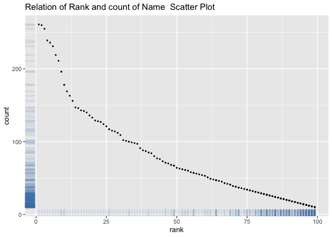

homework2
================
hurricane
10/5/2021

# problem 1

## Read and clean Mr.Trash Wheel sheet

``` r
trash_wheel=
  read_excel("data/trash_wheel_collection.xlsx",range="A2:N408") %>%   
  janitor::clean_names() %>% 
  na.omit(dumpster) %>% 
  mutate(sports_balls=round(sports_balls,0)) 
  #mutate_at(vars(sports_balls),funs(round(sports_balls,0)))
  #mutate(sports_balls=round(pull(trash_wheel,sports_balls)))
```

## Read and clean precipatation data for 2018 and 2019

``` r
precip2018_df=
  read_excel("data/trash_wheel_collection.xlsx",sheet=5,range="A2:B15") %>% 
  janitor::clean_names() %>% 
  na.omit() %>% 
  mutate(year="2018") %>% 
  select(year,everything())


precip2019_df=
  read_excel("data/trash_wheel_collection.xlsx",sheet=4,range="A2:B15") %>% 
  janitor::clean_names() %>% 
  na.omit() %>% 
  mutate(year="2019") %>% 
  select(year,everything())


precip_2018_2019_df=bind_rows(precip2018_df,precip2019_df) %>% 
  janitor::clean_names() %>% 
  mutate(month.name[month]) %>% 
  select(!month) %>% 
  rename("month"="month.name[month]") %>% 
  select(year,month,total) 
```

The first sheet of Mr.Trash Wheel dataset includes 344 rows and 14
variables which provide us with information about weight of trash
collected by Mr.Trash Wheel from May 2014 to June 2019. Furthermore, it
lists weight of different types of trash which shows in
plastic\_bottles, polystyrene columns and so on.

Mr.Trash Wheel dataset also includes every month’s precipitation data
for 2018 and 2019, which has 18 rows and 3 columns.

The total precipitation in 2018 is 70.33 and the median number of sports
balls in a dumpster in 2019 is 8

# Problem 2

``` r
pols_month_df=
  read_csv("data/fivethirtyeight_datasets/pols-month.csv") %>% 
  janitor::clean_names() %>% 
  separate(mon,into=c("year","month","day"),sep="-") %>% 
  mutate(year=as.integer(year),month=as.integer(month),day=as.integer(day)) %>% 
  mutate(month=month.name[as.numeric(month)]) %>%       
  mutate(president=ifelse(prez_gop==1,"gop","dem")) %>% 
  select(!prez_gop & !prez_dem) %>% 
  
  
  
  
  select(!day) %>% 
  filter(!president == "prez_gop",!president == "prez_dem") %>% 
  mutate(month=substring(month,0,3),year=as.numeric(year))
```

    ## Rows: 822 Columns: 9

    ## ─ Column specification ────────────────────────────
    ## Delimiter: ","
    ## dbl  (8): prez_gop, gov_gop, sen_gop, rep_gop, prez_dem, gov_dem, sen_dem, r...
    ## date (1): mon

    ## 
    ## ℹ Use `spec()` to retrieve the full column specification for this data.
    ## ℹ Specify the column types or set `show_col_types = FALSE` to quiet this message.

``` r
snp_df=
  read_csv("data/fivethirtyeight_datasets/snp.csv") %>% 
  separate(date,into=c("year","month","day")) %>% 
  mutate(month=month.name[as.numeric(month)]) %>% 
  select(year,everything()) %>% 
  select(!day) %>% 
  arrange(year,month) %>% 
  mutate(year,year=as.numeric(year)+2000)
```

    ## Rows: 787 Columns: 2

    ## ─ Column specification ────────────────────────────
    ## Delimiter: ","
    ## chr (1): date
    ## dbl (1): close

    ## 
    ## ℹ Use `spec()` to retrieve the full column specification for this data.
    ## ℹ Specify the column types or set `show_col_types = FALSE` to quiet this message.

``` r
unemployment_df=
  read_csv("data/fivethirtyeight_datasets/unemployment.csv") %>% 
  pivot_longer(2:13, names_to="month",values_to="unemployment_rate"
  ) %>% 
  janitor::clean_names() %>% 
  arrange(year,month)
```

    ## Rows: 68 Columns: 13

    ## ─ Column specification ────────────────────────────
    ## Delimiter: ","
    ## dbl (13): Year, Jan, Feb, Mar, Apr, May, Jun, Jul, Aug, Sep, Oct, Nov, Dec

    ## 
    ## ℹ Use `spec()` to retrieve the full column specification for this data.
    ## ℹ Specify the column types or set `show_col_types = FALSE` to quiet this message.

``` r
merge_snp_unemployment_df1=
  left_join(pols_month_df,snp_df,by=c("year","month"))
  
merge_snp_unemployment_df2=
  left_join(merge_snp_unemployment_df1,unemployment_df,by=c("year","month"))
```

## Problem 3

### Clean baby name

``` r
baby_name_df=
  read_csv("data/Popular_Baby_Names.csv") %>% 
  janitor::clean_names() %>% 
  mutate(childs_first_name=tolower(childs_first_name)) %>% 
  mutate(childs_first_name=str_to_title(childs_first_name)) %>% 
  mutate(ethnicity = replace(ethnicity,ethnicity=="ASIAN AND PACI","ASIAN AND PACIFIC ISLANDER")) %>% 
  mutate(ethnicity = replace(ethnicity,ethnicity=="BLACK NON HISP","BLACK NON HISPANIC")) %>% 
  mutate(ethnicity = replace(ethnicity,ethnicity=="WHITE NON HISP","WHITE NON HISPANIC")) %>% 
  distinct() %>% 
  arrange(year_of_birth)
```

    ## Rows: 19418 Columns: 6

    ## ─ Column specification ────────────────────────────
    ## Delimiter: ","
    ## chr (3): Gender, Ethnicity, Child's First Name
    ## dbl (3): Year of Birth, Count, Rank

    ## 
    ## ℹ Use `spec()` to retrieve the full column specification for this data.
    ## ℹ Specify the column types or set `show_col_types = FALSE` to quiet this message.

### Well-structured, reader-friendly table

``` r
baby_name_df=
  read_csv("data/Popular_Baby_Names.csv") %>% 
  janitor::clean_names() %>% 
  mutate(childs_first_name=tolower(childs_first_name)) %>% 
  mutate(childs_first_name=str_to_title(childs_first_name)) %>% 
  distinct() %>% 
  arrange(ethnicity,year_of_birth) %>% 
  filter(childs_first_name=="Olivia") %>% 
  mutate(ethnicity = replace(ethnicity,ethnicity=="ASIAN AND PACI","ASIAN AND PACIFIC ISLANDER")) %>% 
  mutate(ethnicity = replace(ethnicity,ethnicity=="BLACK NON HISP","BLACK NON HISPANIC")) %>% 
  mutate(ethnicity = replace(ethnicity,ethnicity=="WHITE NON HISP","WHITE NON HISPANIC")) %>% 
  select(-count,-gender,-childs_first_name) %>% 
pivot_wider(
    names_from = "year_of_birth",
    values_from = "rank"
    ) 
```

    ## Rows: 19418 Columns: 6

    ## ─ Column specification ────────────────────────────
    ## Delimiter: ","
    ## chr (3): Gender, Ethnicity, Child's First Name
    ## dbl (3): Year of Birth, Count, Rank

    ## 
    ## ℹ Use `spec()` to retrieve the full column specification for this data.
    ## ℹ Specify the column types or set `show_col_types = FALSE` to quiet this message.

## a table showing the most popular name among male children over time

``` r
baby_name_df=
  read_csv("data/Popular_Baby_Names.csv") %>% 
  janitor::clean_names() %>% 
  mutate(childs_first_name=tolower(childs_first_name)) %>% 
  mutate(childs_first_name=str_to_title(childs_first_name)) %>% 
  distinct() %>% 
  arrange(ethnicity,year_of_birth) %>% 
  filter(gender=="MALE") %>% 
  mutate(ethnicity = replace(ethnicity,ethnicity=="ASIAN AND PACI","ASIAN AND PACIFIC ISLANDER")) %>% 
  mutate(ethnicity = replace(ethnicity,ethnicity=="BLACK NON HISP","BLACK NON HISPANIC")) %>% 
  mutate(ethnicity = replace(ethnicity,ethnicity=="WHITE NON HISP","WHITE NON HISPANIC")) %>% 
  arrange(year_of_birth) %>% 
  filter(rank=="1") %>% 
  select(-gender,-count,-rank) %>% 
  pivot_wider(
    names_from="year_of_birth",
    values_from="childs_first_name"
  ) 
```

    ## Rows: 19418 Columns: 6

    ## ─ Column specification ────────────────────────────
    ## Delimiter: ","
    ## chr (3): Gender, Ethnicity, Child's First Name
    ## dbl (3): Year of Birth, Count, Rank

    ## 
    ## ℹ Use `spec()` to retrieve the full column specification for this data.
    ## ℹ Specify the column types or set `show_col_types = FALSE` to quiet this message.

## A scatter plot

``` r
baby_name_df=
  read_csv("data/Popular_Baby_Names.csv") %>% 
  janitor::clean_names() %>% 
  mutate(childs_first_name=tolower(childs_first_name)) %>% 
  mutate(childs_first_name=str_to_title(childs_first_name)) %>% 
  distinct() %>% 
  arrange(ethnicity,year_of_birth) %>% 
  mutate(ethnicity = replace(ethnicity,ethnicity=="ASIAN AND PACI","ASIAN AND PACIFIC ISLANDER")) %>% 
  mutate(ethnicity = replace(ethnicity,ethnicity=="BLACK NON HISP","BLACK NON HISPANIC")) %>% 
  mutate(ethnicity = replace(ethnicity,ethnicity=="WHITE NON HISP","WHITE NON HISPANIC")) %>% 
  arrange(year_of_birth) %>% 
  filter(gender=="MALE",ethnicity=="WHITE NON HISPANIC",year_of_birth=="2016") %>%
  select(childs_first_name,count,rank)
```

    ## Rows: 19418 Columns: 6

    ## ─ Column specification ────────────────────────────
    ## Delimiter: ","
    ## chr (3): Gender, Ethnicity, Child's First Name
    ## dbl (3): Year of Birth, Count, Rank

    ## 
    ## ℹ Use `spec()` to retrieve the full column specification for this data.
    ## ℹ Specify the column types or set `show_col_types = FALSE` to quiet this message.

``` r
#library(ggplot2)

ggplot(baby_name_df,aes(x=rank,y=count),main="Relation of Rank and count of Name  Scatter Plot") + 
  geom_point(size=0.5) +
  geom_rug(col="steelblue",alpha=0.1, size=1.5) + ggtitle("Relation of Rank and count of Name  Scatter Plot")
```

<!-- -->

``` r
  #geom_text(label=baby_name_df$childs_first_name,size=3,check_overlap = T)
#scatterplot(rank ~ count | childs_first_name, data=baby_name_df,
```
